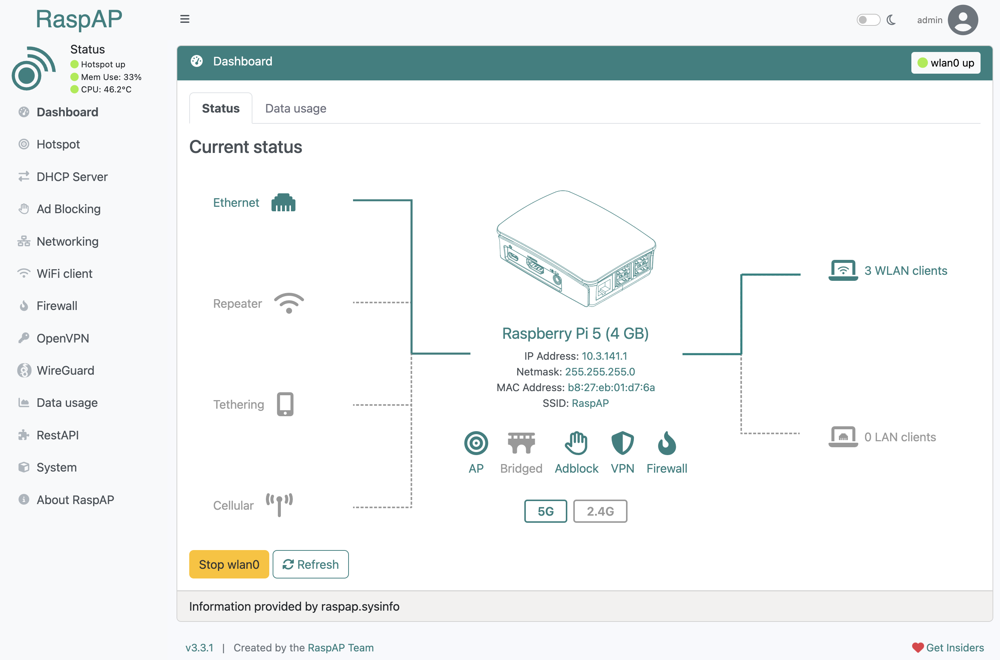



Welcome to RaspAP!

<a class="btn btn-lg btn-primary me-3 mb-4" href="https://docs.raspap.com/">
  Read Our Docs <i class="fas fa-arrow-alt-circle-right ms-2"></i>
</a>
<a class="btn btn-lg btn-primary me-3 mb-4" href="https://github.com/sponsors/RaspAP">
  Join Insiders <i class="fas fa-arrow-alt-circle-right ms-2 "></i>
</a>
<a class="btn btn-lg btn-primary me-3 mb-4" href="https://github.com/RaspAP/raspap-webgui/releases">
  Download <i class="fab fa-github ms-2 "></i>
</a>

The easiest, full-featured wireless router setup for Debian-based devices. Period.

   

    


{}
<h2>More than an access point</h2>
 

  

RaspAP is feature-rich wireless router software that <i>just works</i> on many popular Debian-based devices, including the Raspberry Pi.
Customizable, mobile-friendly interface in 20+ languages. Sets up in minutes.

  

    

      <i class="fas fa-key"></i> 
    

    

      <h3 class="sub-title">Multiple VPN options</h3>
      
Popular <a href="https://docs.raspap.com/features-core/openvpn/">OpenVPN</a>, cutting edge <a href="https://docs.raspap.com/features-core/wireguard/">WireGuard</a> and <a href="https://docs.raspap.com/features-insiders/tailscale/">Tailscale</a> encrypted tunnels may be configured to securely connect your client devices.

    
<!--//content-->
  
<!--//item-->
  

    

      <i class="far fa-hand-paper"></i> 
    

    

      <h3 class="sub-title">Ad block integration</h3>
      
Streamline AP throughput for your clients by sending requests for ads, trackers and other undesirable hosts to <a href="https://docs.raspap.com/features-core/adblock/">DNS blacklist oblivion</a>.

    
<!--//content-->
  
<!--//item-->
  

    

      <i class="fas fa-archway"></i> 
    

    

      <h3 class="sub-title">Bridged mode</h3>
      
Want your upstream router to assign IP addresses? RaspAP lets you change the default routed configuration to an alternate <a href="https://docs.raspap.com/features-core/bridged/">bridged AP</a> mode.

    
<!--//content-->
  
<!--//item-->           
  <!-- 

     -->
  

    

      <i class="fas fa-code"></i> 
    

    

      <h3 class="sub-title">Easy to customize</h3>
      
Modify RaspAP to suit your needs with a completely exposed <a href="https://docs.raspap.com/get-started/defaults/">default configuration</a>, many <a href="https://docs.raspap.com/get-started/quick-installer/">installation options</a>, themes and more.

    
<!--//content-->
  
<!--//item-->                
  

    

      <i class="fab fa-docker"></i>
    

    

      <h3 class="sub-title">Docker ready</h3>
      
Deploy RaspAP quickly in a portable, lightweight and isolated <a href="https://docs.raspap.com/get-started/docker/">Docker container</a> for all your application needs.

    
<!--//content-->
  
<!--//item-->
  

    

      <i class="fas fa-microchip"></i>
    

    

      <h3 class="sub-title">Made for IoT</h3>
      
Small on memory utilization yet big on features, RaspAP is ideal for IoT applications where <a href="https://www.raspberrypi.org/blog/low-cost-raspberry-pi-zero-endoscope-camera/">wireless connectivity</a> and data sharing are a must.

    
<!--//content-->
  
<!--//item-->               
  

  

    

      <i class="fas fa-puzzle-piece"></i>
    

    

      <h3 class="sub-title">Integrated API</h3>
      
RaspAP includes support for stateless client-server data exchange via a high performance <a href="https://docs.raspap.com/features-experimental/restapi/">RESTful API</a> based on FastAPI.

    
<!--//content-->
  
<!--//item-->
  

    

      <i class="fas fa-plug"></i>
    

    

      <h3 class="sub-title">Custom user plugins</h3>
      
Want to extend RaspAP's functionality? A plugin manager and <a href="https://github.com/RaspAP/SamplePlugin">sample plugin</a> make it easy for developers to create their own <a href="https://docs.raspap.com/features-core/custom-plugins/">custom plugins</a>.

    
<!--//content-->
  
<!--//item-->
  

    

      <i class="fas fa-shield-alt"></i>
    

    

      <h3 class="sub-title">VPN provider control</h3>
      
Administer several of the most popular <a href="https://docs.raspap.com/features-experimental/providers/">VPN providers</a> via their Command Line Interfaces (CLIs) directly in RaspAP's UI.

    
<!--//content-->
  
<!--//item-->
  
<!--//row-->            

{}

{}

  <h2 class="title">Additional Features</h2>
  <ul class="feature-list list-unstyled">
    <li><i class="fas fa-check"></i> Data usage graphs for all interfaces</li>
    <li><i class="fas fa-check"></i> <a href="https://docs.raspap.com/features-core/ssl/">SSL certificate</a> support</li>
    <li><i class="fas fa-check"></i> <a href="https://docs.raspap.com/features-core/captive/">Captive portal</a> integration</li>
    <li><i class="fas fa-check"></i> Up-to-date security audits</li>
    <li><i class="fas fa-check"></i> Advanced DHCP server control</li>
    <li><i class="fas fa-check"></i> 802.11ac 5GHz operation</li>
    <li><i class="fas fa-check"></i> <a href="https://docs.raspap.com/features-insiders/dynamicdns/">Dynamic DNS</a> support</li>
    <li><i class="fas fa-check"></i> Auto-detect external wireless adapters</li>
    <li><i class="fas fa-check"></i> <a href="https://docs.raspap.com/features-core/ap-basics/#wpa3-personal">WPA3-Personal + 802.11w</a> support</li>
    <li><i class="fas fa-check"></i> <a href="https://github.com/RaspAP/raspap-docker">Docker</a> support</li>
  <li><i class="fas fa-check"></i> Fully responsive + mobile-ready</li>
  </ul>

<!--//container-->
{}

{}
 

  

  <h2 class="title text-center">Quick Start</h2>
    

      
RaspAP gives you two different ways to get up and running quickly. The simplest approach is to use a <a href="https://github.com/RaspAP/raspap-webgui/releases/latest">custom OS image</a> with RaspAP preinstalled. This option eliminates guesswork and gives you a base upon which to build. An alternative method is to execute the Quick installer on an existing <a href="#distros">compatible OS</a>.

      <h3 class="sub-title text-center">Custom OS</h3>
      
Custom Raspberry Pi OS Lite images with the latest RaspAP are available for <a href="https://github.com/RaspAP/raspap-webgui/releases/latest">direct download</a>. This includes both 32- and 64-bit builds for ARM architectures.

      

        <table class="table table-hover table-sm">
          <thead>
            <tr>
              <th scope="col">Distribution</th>
              <th scope="col">Debian version</th>
              <th scope="col">Kernel version</th>
              <th scope="col">RaspAP version</th>
              <th scope="col">Size</th>
            </tr>
          </thead>
          <tbody>
            <tr>
              <th scope="row">Raspberry Pi OS (64-bit) Lite</th>
              <td>12 (bookworm)</td>
              <td>6.6</td>
              <td>Latest</td>
              <td>869 MB</td>
            </tr>
            <tr>
              <th scope="row">Raspberry Pi OS (32-bit) Lite</th>
              <td>12 (bookworm)</td>
              <td>6.6</td>
              <td>Latest</td>
              <td>897 MB</td>
            </tr>
          </tbody>
        </table>
      

  
These images are automatically generated with each release of RaspAP and are made <a href="https://github.com/RaspAP/raspap-webgui/releases/latest">available here</a>. You may choose between an <code style="color: #EEEEEE;">arm64</code> or <code style="color: #EEEEEE;">armhf</code> (32-bit) based build.

  
After downloading your desired image, use a utility such as the Raspberry Pi Imager or <a href="https://www.balena.io/etcher">balenaEtcher</a> to flash the OS image onto a microSD card. Insert the card into your device and boot it up. The latest RaspAP release with the most popular components will be active and ready for you to configure.

  <h3 class="sub-title text-center">Quick installer</h3>
  
Alternatively, begin with a clean install of the latest release of a <a href="#distros">supported Linux distribution</a>. In the example below, <a href="https://www.raspberrypi.com/software/operating-systems/#raspberry-pi-os-64-bit">Raspberry Pi OS (64-bit) Lite</a> is used.
  Update your OS to its latest version, including the kernel and firmware, followed by a reboot:

  <code style="color: #EEEEEE;">
    sudo apt-get update 
    sudo apt-get full-upgrade 
    sudo reboot
  </code>

<!--//code-block-->

Set the WiFi country in <code style="color: #EEEEEE;">raspi-config</code>'s <strong>Localisation Options</strong>:

  <code style="color: #EEEEEE;">
    sudo raspi-config
  </code>

<!--//code-block-->

Invoke RaspAP's Quick Installer:

  <code style="color: #EEEEEE;">
    curl -sL https://install.raspap.com | bash
    </code>
  
<!--//code-block-->

  
The <a href="https://docs.raspap.com/get-started/quick-installer/">Quick installer</a> will complete the steps in the <a href="https://docs.raspap.com/get-started/manual/">manual installation</a> for you. At the end of the install process, accept the prompt to reboot your system.

  <h3 class="sub-title text-center">Initial settings</h3>
    
After completing either of these setup options, the wireless AP network will be configured as follows:

    <ul class="list-unstyled padding-left">
      <li><strong>IP address:</strong> 10.3.141.1</li>
      <li><strong>Username:</strong> admin</li>
      <li><strong>Password:</strong> secret</li>
      <li><strong>DHCP range:</strong> 10.3.141.50 — 10.3.141.254</li>
      <li><strong>SSID:</strong> RaspAP</li>
      <li><strong>Password:</strong> ChangeMe</li>
    </ul>
  

  
It is strongly recommended that you change these default credentials in RaspAP's <strong>Authentication</strong> and <strong>Hotspot > Security</strong> panels.

Your AP's <a href="https://docs.raspap.com/features-core/ap-basics/">basic settings</a> and many <a href="https://docs.raspap.com/features-core/ap-basics/#advanced-options">advanced options</a> may now be modified by RaspAP.

    
<!--//block-->

  

    <a id="distros"><h3 class="sub-title text-center" style="align:center;">Supported Distributions</h3></a>
    
RaspAP was originally made for Raspberry Pi OS, but now also installs on the following Debian-based distros.

    

    <table class="table table-hover table-sm">
      <thead>
        <tr>
          <th scope="col">Distribution</th>
          <th scope="col">Release</th>
          <th scope="col">Architecture</th>
          <th scope="col">Support</th>
        </tr>
      </thead>
      <tbody>
        <tr>
          <th scope="row">Raspberry Pi OS</th>
          <td>(64-bit) Lite Bookworm</td>
          <td>ARM</td>
          <td>Official</td>
        </tr>
        <tr>
          <th scope="row">Raspberry Pi OS</th>
          <td>(32-bit) Lite Bookworm</td>
          <td>ARM</td>
          <td>Official</td>
        </tr>
        <tr>
          <th scope="row">Raspberry Pi OS</th>
          <td>(64-bit) Desktop Bookworm</td>
          <td>ARM</td>
          <td>Official</td>
        </tr>
        <tr>
          <th scope="row">Raspberry Pi OS</th>
          <td>(64-bit) Lite Bullseye</td>
          <td>ARM</td>
          <td>Official</td>
        </tr>
        <tr>
          <th scope="row">Raspberry Pi OS</th>
          <td>(32-bit) Lite Bullseye</td>
          <td>ARM</td>
          <td>Official</td>
        </tr>
    <tr>
          <th scope="row">Armbian</th>
          <td>23.11 (Jammy)</td>
          <td><a href="https://www.armbian.com/rpi4b/">ARM</a></td>
          <td>Beta</td>
        </tr>
        <tr>
          <th scope="row">Debian</th>
          <td>Bookworm</td>
          <td>ARM / x86_64</td>
          <td>Beta</td>
        </tr>
      </tbody>
    </table>
    
<!--//table-responive-->
    

      
    

    

      You are also encouraged to try RaspAP's community-led <a href="https://github.com/RaspAP/raspap-docker">Docker container</a>.
    

  
<!--//block-->

  

    <h3 class="sub-title text-center">Documentation and more</h3>
    
Our <a href="https://docs.raspap.com/faq/">frequently asked questions (FAQ)</a> are continuously updated and are a great place to start. Need help not covered in the FAQ, have an idea or want to share your project
    with the RaspAP community? Head over to our GitHub <a href="https://github.com/RaspAP/raspap-webgui/discussions">Discussions</a>. For everything else, dive into our official documentation.

    

    <a class="btn btn-lg btn-dark" href="https://docs.raspap.com/" target="_blank">RaspAP docs</a>
    

  
<!--//block-->

  
<!--//docs-inner-->         

{}

{}
{}
[Server link](https://discord.gg/KVAsaAR)
{}

{}
We do a [Pull Request](https://github.com/google/docsy-example/pulls)
contributions workflow on **GitHub**. New users are always welcome! [RaspAP-WebGUI Repo](https://github.com/raspap/raspap-webgui)
{}

{}
For announcements of latest features, and more. [@Rasp_AP](https://x.com/rasp_ap/)
{}

{}